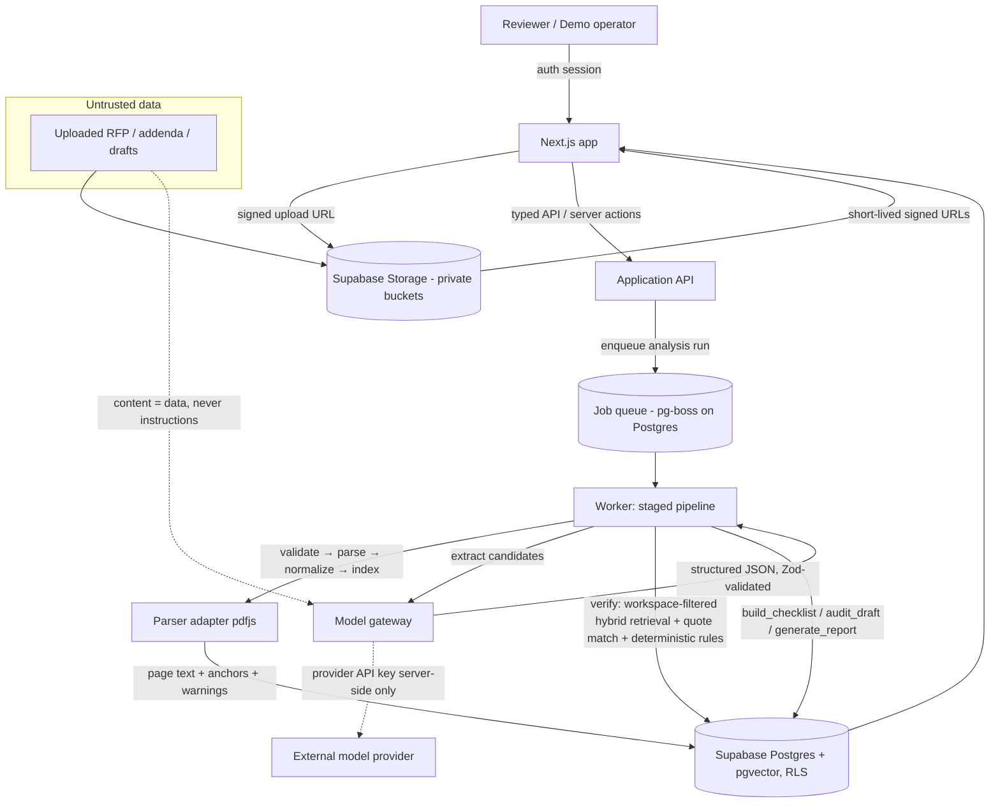

# Architecture Summary — AI RFP Compliance Auditor (Demo)

Condensed from `USI_AI_RFP_Compliance_Auditor_Engineering_Design.md` (v1.0, 2026-07-16), plus concrete Phase 0 selections (see `decision-log.md`). Architecture style: modular web app + asynchronous document-analysis jobs, optimized for evidence quality and reproducibility.

## Components (Design §3)

| Component                         | Responsibility                                                                   | Failure behavior                                                     |
| --------------------------------- | -------------------------------------------------------------------------------- | -------------------------------------------------------------------- |
| Next.js web app                   | Auth, workspaces, upload UI, register, evidence viewer, checklist, audit, report | Explicit error states; preserve completed server results             |
| Application API                   | Validate commands, authorize, create jobs, typed resources, state transitions    | Structured errors; never infer success from partial model output     |
| Background worker                 | Parse, model calls, verification, progress, exports                              | Idempotent stages; retry transient; terminal failure w/ stage detail |
| Parser adapter                    | Page text, blocks, tables, coordinates where possible                            | Store warnings + page assets; page-level fallback                    |
| Extraction service                | Schema-constrained candidate requirements/checklist items                        | Reject invalid schema; preserve raw response for debugging           |
| Verification service              | Validate evidence, dedupe, addendum compare, classify confidence                 | Downgrade to unverified if source support missing                    |
| Draft audit service               | Segment claims; compare to workspace sources                                     | Return "requires human proof" instead of guessing                    |
| Postgres (Supabase)               | Domain records, evidence, embeddings, jobs, decisions, audit events              | Transactional updates; versioned migrations                          |
| Object storage (Supabase Storage) | Source files, page artifacts, parsed artifacts, exports                          | Private buckets; signed URLs; retention controls                     |
| Model gateway                     | Normalize provider calls, prompts, schemas, timeouts, costs, metadata            | Optional fallback provider; never mix workspace context              |

## Data flow



## Selected stack (Design §4 + Phase 0 decisions)

| Layer         | Selection                                                                                                                                                                       | Notes                                                                                                   |
| ------------- | ------------------------------------------------------------------------------------------------------------------------------------------------------------------------------- | ------------------------------------------------------------------------------------------------------- |
| Language      | TypeScript, `strict`                                                                                                                                                            | Shared Zod schemas                                                                                      |
| Web           | Next.js App Router (latest stable, verify via Context7 at Phase 1)                                                                                                              | Server actions/API routes; long tasks in worker                                                         |
| UI            | React + Tailwind CSS + accessible primitives (Radix-based)                                                                                                                      | Enterprise dashboard patterns                                                                           |
| DB            | Supabase PostgreSQL 17 — project `RFP demo` (`uxmxkdjschbekkbnweby`, us-east-2)                                                                                                 | RLS on all app tables                                                                                   |
| Storage       | Supabase Storage, private buckets, expiring signed URLs                                                                                                                         | Workspace-scoped object keys                                                                            |
| Auth          | Supabase Auth (email/password), public signup disabled, seeded demo users                                                                                                       | Production SSO out of scope                                                                             |
| Queue         | pg-boss (Postgres-backed) in a Node worker                                                                                                                                      | No new paid service; stage retries + visibility                                                         |
| PDF parsing   | `pdfjs-dist` adapter behind `ParserAdapter` interface (page text + offsets); evidence viewer renders pages via pdf.js from signed URL                                           | OCR out of scope for demo fixture (machine-readable); interface allows swap                             |
| Model gateway | Internal `ModelGateway`; Phase 3 extraction and Phase 4 verification use separately selected pinned models; deterministic `MockProvider` remains the default test/fallback path | Record provider, model, version, tokens, latency, cost; unrestricted live verification remains disabled |
| Validation    | Zod + provider JSON-schema-constrained output                                                                                                                                   | Never free-parse critical fields                                                                        |
| Retrieval     | Hybrid: Postgres FTS/pg_trgm (lexical) + pgvector (semantic), always workspace-filtered                                                                                         | Citations validated against stored page text before display                                             |
| Testing       | Vitest, Playwright (`playwright-cli` skill available), fixture evaluator                                                                                                        | Snapshot structured outputs only after normalization                                                    |
| Deployment    | Local-first demo; hosting decision deferred (OQ-2)                                                                                                                              | Env vars outside repository                                                                             |

## Repository layout (Design §4.1, npm workspaces)

```text
apps/web         # Next.js application
apps/worker      # asynchronous analysis jobs (pg-boss consumer)
packages/domain  # entities, enums, state transitions
packages/db      # schema types, repositories (workspace predicate mandatory)
packages/documents # parser adapters, normalization, page anchors
packages/ai      # model gateway, prompts (versioned), extraction, verification
packages/evaluation # known-answer fixtures and scoring
packages/ui      # shared components
packages/config  # environment validation (zod) and feature flags
fixtures/demo-rfp    # synthetic RFP, addenda, expected answers
fixtures/draft-audit # planted unsupported/contradictory claims
supabase/migrations  # version-controlled SQL migrations
docs/            # this documentation set
```

## Domain model & schema (Design §5)

Core tables (all app tables carry `workspace_id` where applicable; RLS enforced):

`workspaces`, `documents` (type, filename, mime, object_key, sha256, version, parse_status, page_count), `document_pages` (page_number, text, blocks jsonb, image/asset key, parse_confidence, warnings), `analysis_runs` (status, current_stage, progress, prompt_set_version, error, metrics), `model_calls` (stage, provider, model, request_hash, token_usage, latency_ms, cost_estimate, response_object_key, success), `requirements` (canonical_key, category, title, description, mandatory, deadline, severity, confidence, review_status, owner_id, source_status), `evidence_spans` (requirement_id/audit_finding_id, document_page_id, quote, offsets, bbox, support_type, verifier_score), `checklist_items` (category, name, mandatory, status, due_at, owner_id, blocker, artifact_document_id, exception_note), `drafts`, `draft_claims` (section_path, claim_text, claim_type, offsets), `audit_findings` (classification, severity, explanation, resolution_status, confidence), `review_decisions` (target_type/id, decision, note, user_id), `audit_events` (immutable; actor, event_type, entity, payload), `exports` (type, object_key, sha256, created_by).

Key enums (Design §5.3): `document_type` (primary_rfp, addendum, attachment, proposal_draft, reference, expected_answer); `analysis_status` (queued, parsing, extracting, verifying, auditing, generating_report, completed, failed, cancelled); `requirement_category` (form, deadline, submission_instruction, insurance, bond, certification, staffing, training, pricing, technical, legal, meeting, evaluation, other); `review_status` (unreviewed, confirmed, corrected, rejected, exception, not_applicable, superseded); `checklist_status` (missing, identified, in_progress, attached, verified, waived, not_applicable); `claim_classification` (supported, partially_supported, unsupported, contradicted, requires_human_proof, not_applicable); `severity` (info, low, medium, high, critical).

## Pipeline stages (Design §6)

```text
validate → parse → normalize → index → extract → verify → build_checklist → audit_draft → generate_report
```

- Each stage records status, timing, retry count, errors, input/output refs, analysis-run identity; completion keyed by `analysis_run_id + stage_name + input_hash` (idempotent, replayable).
- Chunking: page-primary; secondary 600–1,200-token windows, 10–15% overlap, never crossing documents; chunks carry doc ID, page, section path, addendum precedence, block IDs, parser confidence.
- Addenda: versioned/ordered; superseded requirements stay visible with links to controlling addendum; unresolvable conflicts flagged for humans; readiness uses latest confirmed controlling requirement.
- Model stages retry timeouts/rate limits with bounds; schema-invalid logical output is not blind-retried — repair is a controlled, observable step.

## AI design (Design §7)

1. Candidate extractor (strict schema, `RequirementCandidate` with source {documentId, pageNumber, sectionPath, quote} + advisory confidence).
2. Evidence resolver — workspace-only retrieval.
3. Candidate-centered verifier — Pass A entailment and conditional Pass B adversarial challenge use separate prompts, schemas, and call records; neither can assign the persisted final status.
4. Rule engine — deterministic quote/page validation, dates, form references, numeric thresholds, parser quality, duplicates, and explicit addendum precedence derive the machine assessment. Models never decide numeric equivalence or final precedence without deterministic evidence.
5. Machine axes remain separate: source support, precedence, proof requirement, and human review. A supported machine finding remains `machine_assessment_only` and `pending`; it is never silently converted into human approval, compliance, completion, or submission readiness.

### Qualified Phase 4 verification path

- Configuration fingerprint `c52d49b8302b7f47b4751e0d4f3d092001209337e21c755e950ee4fb81fe001b` pins `gpt-5.5-2026-04-23`, low reasoning, two evidence contexts, 1,800/1,600/600 output limits, 90-second timeout, v7/v5 Pass A, v4/v4 Pass B, facts v4, decision v6, evaluator v3, final schema v1, atomic parent/child v1, Responses API, `store:false`, and no tools.
- Production asserts the fingerprint before provider construction and persists it on analysis runs, verification runs, and model calls. Environment drift cannot override a fingerprinted value.
- `verification_runs`, immutable `verification_fact_envelopes`, `verification_pass_results`, versioned `verification_findings`, exact `verification_evidence`, non-destructive `requirement_relationships`, and append-only/revision-audited `human_review_decisions` preserve the complete lifecycle.
- Live verification is selected but rollout-restricted: ordinary/confidential workspaces continue to use the deterministic mock/human path. Only the immutable synthetic scope can enable the provider until a separate rollout decision.

Readiness (deterministic, Design §7.6): criticalBlockers>0 → NOT_READY; unreviewed mandatory → NEEDS_REVIEW; unresolved high findings → NEEDS_REVIEW; approvals incomplete → NEEDS_APPROVAL; else READY_FOR_FINAL_HUMAN_REVIEW. Never "compliant" or "safe to submit".

## Phase 5 deterministic workflow layer

Phase 5 consumes immutable Phase 4 findings through `checklist-eligibility-v1`, `checklist-generator-v1`, `checklist-blockers-v1`, and `checklist-readiness-v1`. It adds no model calls. Machine structure, source provenance, human workflow, artifact state, waivers, blockers, and readiness remain separate. Stable keys and input hashes make generation idempotent; regeneration reuses stable records, preserves human edits, and marks obsolete machine structure instead of deleting it. See `docs/phase5-data-flow.md`.

## Phase 6 deterministic proposal-audit layer

Phase 6 reuses private `proposal_draft` ingestion and consumes one completed Phase 5 checklist generation. `proposal-section-parser-v1`, `proposal-claim-segmenter-v1`, `proposal-response-matcher-v1`, `proposal-support-policy-v1`, `proposal-contradiction-v1`, and `proposal-audit-evaluator-v1` create page-anchored atomic claims, requirement coverage, evidence support, deterministic consistency checks, and machine-only findings without a provider call. Draft revisions and findings are immutable; human resolutions append separately. See `docs/phase6-data-flow.md`.

## Phase 7 deterministic reporting and export layer

Phase 7 binds one compatible completed Phase 4 verification, Phase 5 checklist/readiness snapshot, and Phase 6 proposal audit/revision into `report-input-v1`. `report-aggregation-v1` computes explicit phase-specific blocker, unresolved, artifact, review, and source-coverage denominators; it never recomputes or updates upstream state. `report-schema-v1` snapshots are immutable and idempotent by canonical SHA-256.

`report-csv-v1` emits deterministic formula-neutralized UTF-8 CSV datasets. `report-html-v1` emits escaped self-contained structured reports. Exports use a service-only private bucket, immutable manifests, unique regeneration numbers, SHA-256 integrity, seven-day retention, and 300-second authorized download grants. Signed URLs and object paths are never persisted in report artifacts or exposed through authenticated table reads. Routes `/w/:id/reports` and `/w/:id/reports/:snapshotId` provide report selection, filters, pagination, evidence drill-down, source-page navigation, export generation, download, and revocation. See `docs/phase7-data-flow.md` and `docs/phase7-database.md`.

## API surface (Design §8.2) and routes (Design §9.1)

REST-ish routes: workspaces CRUD, signed uploads, document finalize, analysis-runs start/status, requirements list/patch, evidence get, checklist list/patch, drafts + audits + findings, exports. Error contract: `{code, message, stage?, retryable, correlationId, details?}` — never expose secrets or raw provider errors.

Frontend routes: `/` (workspace list), `/w/:id` (overview), `/w/:id/documents`, `/w/:id/requirements`, `/w/:id/requirements/:reqId` (evidence viewer), `/w/:id/checklist`, `/w/:id/proposal-audit`, `/w/:id/proposal-audit/:auditRunId`, `/w/:id/reports`, and `/w/:id/reports/:snapshotId`.

UI state model: every async view supports empty/loading/progress/success/terminal-error/retryable-error; source status displayed separately from extraction confidence; blockers pinned; protected "Reset fixture" control.

## Environments & CI (Design §13)

local (dev, unit/integration), preview (mock/sandbox model), demo (frozen fixture, stable URL). Server-only environment validation includes database/storage secrets, `MAX_PAGES_PER_WORKSPACE=500`, `MAX_UPLOAD_BYTES=104857600`, model-cost limits, and bounded stage concurrency. CI gates: typecheck, lint, unit tests, migration validation, secret scan, fixture-evaluation thresholds, Playwright smoke.

## Phase 8 final hardening layer

`phase8-consolidated-evaluation-v1` recomputes the provider-free Phase 4–7 known answers and one strict consolidated gate. The Phase 8 control plane adds fixed database-atomic rate buckets, advisory-locked budget reservations before provider construction, privacy-safe performance events, immutable synthetic scope/cache/fallback records, and an idempotent presentation-state reset. The prepared route is `/w/:id/demo`; it requires the exact validated cache rather than merely a membership.

## Role-based presentation architecture

`role-based-ux-v1` is a presentation layer over the stable Phase 4–8 data contracts. `AppHeader` supplies five global destinations and a local role-view preference; workspace RLS and controlled server/RPC paths remain authoritative. Home, My Work, Reports, and Search derive only from existing tenant-scoped reads. No role-view value is used as authorization or persisted as a permission. Opportunity pages share a six-destination local navigation and a nine-step business/processing/review journey. See `docs/rfp-product-ux-guide.md`.

The prepared scope binds every Phase 4–7 run/document/hash/version and the qualified Phase 4 fingerprint. Prepared, cached, fallback, and offline-read-only modes remain authorized and visibly labeled. The fallback reuses one immutable private Phase 7 artifact via a transient five-minute grant. See `docs/phase8-data-flow.md` and `docs/demo-reset-cache-fallback.md`.

## Executive presentation layer

The web application projects the unchanged Phase 4–8 records into two display modes. Executive view is the default and emphasizes deadlines, decision signals, next actions, blockers, ownership, missing proof, and human review. Analyst view reveals model/run/schema/hash and detailed filtering controls. The preference is browser-local presentation state; it is not an authorization boundary and never changes persisted findings or calculations.

`WorkspaceNavigation` supplies the shared journey: Overview → RFP files → RFP requirements → Submission plan → Draft review → Final review. `presentation.ts` centralizes business labels, tone, deadlines, and event names so technical enum values remain stable in storage and APIs. Detail pages remain provenance-first: every simplified status links back to exact evidence, original page, and the separate machine/human axes.

## Post-roadmap mixed-format and large-document layer

`document-parser-adapters-v1` routes PDF, DOCX, XLSX, HTML, TXT, approved images, and safe ZIP packages into `normalized-document-v1` and `normalized-table-v1`. It preserves native provenance, structured cells, heading hierarchy, parser confidence, selective-OCR state, and hashes. `large-document-jobs-v1` persists stage/work-unit progress and leases; one PDF page can be retried without replacing completed pages.

`requirement-prefilter-v1` and `whole-document-selection-v1` inspect the complete document before bounded evidence-coherent batching. Cache keys bind every material input/version; `targeted-cache-invalidation-v1` invalidates downstream addendum-dependent analysis while retaining unchanged normalization. Cost estimates and server-capped concurrency are visible before analysis. See `docs/large-document-data-flow.md` and `docs/large-document-normalized-model.md`.

# Phase 9 coverage-led live analysis

The qualified FAC115 path established a reusable coverage-led graph:

`immutable public sources → normalized blocks/cells → coverage ledger → deterministic seeds → exact reduction → compact planned provider tasks → deterministic/semantic findings → human-review queue`.

`phase9-workspace-plan-v2` now applies that graph to explicitly selected, parsed documents in any workspace without accepting a state, agency, fixture, or expected-answer input. Before reduction, `phase9-workspace-candidate-refinement-v1` rejects navigation/table-of-contents text, historical or non-obligatory language, explicit not-applicable statements, and incomplete fragments; it also assigns categories from material obligation language rather than isolated keywords. The application owner must separately confirm data authority and a per-run maximum. The server must opt in with `PHASE9_GENERAL_LIVE_ANALYSIS_ENABLED=true`; a service-owned policy then enforces the lower of the exact plan, the confirmed maximum, the `$3` architectural plan cap, the configured per-run maximum, and a workspace-month ceiling.

The path is server-owned, workspace-filtered, cache-aware, reservation-gated, and fail-closed. Provider calls are non-retrying, use strict structured outputs, `store:false`, and no tools. AI-discovered additions remain `candidate_unverified`; final findings remain `machine_only=true` and `human_review_status=pending`. General Phase 4 verification remains disabled, and Phase 9 records do not rewrite Phase 3 candidates or Phase 4 findings. Expected answers exist only in fixture evaluators and are explicitly absent from ordinary workspace runs. See `phase9-live-ai-recovery.md`.
